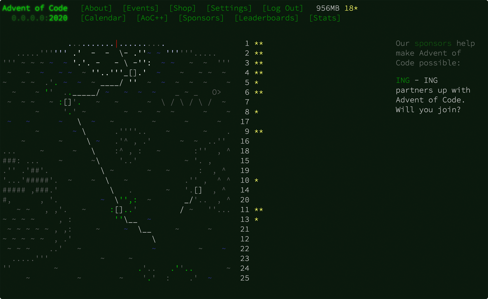
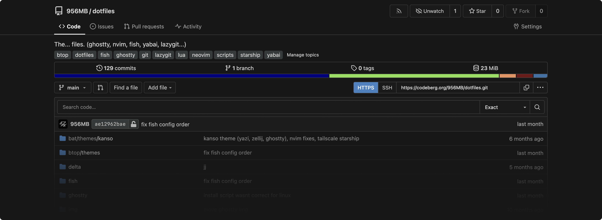
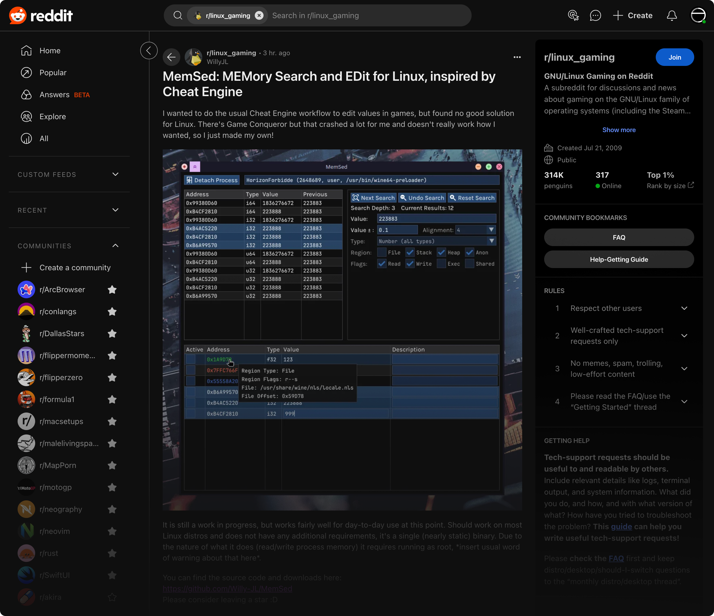

# Boosts

_Boost process works as of **1.124.0 (71787)**. [Arc](https://arc.net/) could change how the boosts function at any time, they update often..._

> [!WARNING]
> These boosts are made based on my own tastes first and foremost, and they are by no means "comprehensive". If I see something is wrong or missing from a boost, I add it. If you for some reason use any of these and notice something wrong or missing, you can let me know with an [issue](https://github.com/956MB/boosts/issues) or [PR](https://github.com/956MB/boosts/pulls).

-   [Advent of Code](./boosts/aoc.css)
-   [Claude](./boosts/claude-neutral.css) / [Claude (Darker)](./boosts/claude-neutral-darker.css) / [Claude (Darkest)](./boosts/claude-neutral-darkest.css)
-   [Codeberg](./boosts/codeberg-gitea-neutral.css) / [Codeberg VSCode Syntax](./boosts/codeberg-gitea-neutral-vscode.css) / [Codeberg Darker](./boosts/codeberg-gitea-neutral-darker.css) / [Codeberg Darker VSCode Syntax](./boosts/codeberg-gitea-neutral-darker-vscode.css)
-   [Github](./boosts/github-neutral-default-syntax.css) / [Github (VSCode Syntax)](./boosts/github-neutral-vscode-syntax.css)
-   [Hugging Face](./boosts/hugging-face-neutral.css)
-   [Reddit](./boosts/reddit-neutral.css)

# Adding boosts

1. Open [Arc](https://arc.net/)
2. Go to corresponding site for the boost you're installing (e.g. [claude.ai](https://claude.ai/))
3. Click the `Site Control Center` button to the right of the URL bar
4. Click `New Boost` button (the paint brush icon)
5. Click `Code` button towards the bottom
6. Copy the CSS from the corresponding boost (e.g. [claude-neutral](./boosts/claude-neutral.css))
7. Paste the copied text into the `CSS` editor

**DONE!**

## Advent of Code

Last updated: 12-05-2025 | [aoc](./boosts/aoc.css)

## Claude

Claude Neutral removes the green-ish/yellow-ish tint from the original claude.ai UI. Neutral greys only.

Last updated: 02-25-2025 | [claude-neutral](./boosts/claude-neutral.css) · [claude-neutral-darker](./boosts/claude-neutral-darker.css) · [claude-neutral-darkest](./boosts/claude-neutral-darkest.css) · [claude-neutral-vscode](./boosts/claude-neutral-vscode.css) · [claude-neutral-darker-vscode](./boosts/claude-neutral-darker-vscode.css) · [claude-neutral-darkest-vscode](./boosts/claude-neutral-darkest-vscode.css)

> ![WARNING]
> Claude has changed the way the code blocks tokens are rendered, so the VSCode syntax highlighting may not be 100% accurate anymore. It has gotten more complex, and I haven't taken the time to update it with all the new/correct colors.

## Codeberg (Gitea theme)

Last updated: 11-29-2025 | [codeberg-gitea-neutral](./boosts/codeberg-gitea-neutral.css) · [codeberg-gitea-neutral-vscode](./boosts/codeberg-gitea-neutral-vscode.css) · [codeberg-gitea-neutral-darker](./boosts/codeberg-gitea-neutral-darker.css) · [codeberg-gitea-neutral-darker-vscode](./boosts/codeberg-gitea-neutral-darker-vscode.css)

## Github

I just don't like blue themes. The boost [github-neutral-vscode-syntax](./boosts/github-neutral-vscode-syntax.css) also implements the syntax highlighting colors from [VSCode](https://github.com/microsoft/vscode)'s default dark theme.

Last updated: 04-11-2025 | [github-neutral-default-syntax](./boosts/github-neutral-default-syntax.css) · [github-neutral-vscode-syntax](./boosts/github-neutral-vscode-syntax.css) · [github-neutral-default-syntax-light](./boosts/github-neutral-default-syntax-light.css)

## Hugging Face (WIP)

Another Neutral modification, this time changing the [Hugging Face](https://huggingface.co/) ~~blue~~ dark theme to my favorite neutral greys an whites. All icons and accent colors are left unchanged. _Not 100% done, some small elements still have blue hover states and stuff. Is *mostly* neutral though_.

Last updated: 08-30-2024 | [hugging-face-neutral](./boosts/hugging-face-neutral.css)

## Reddit

Last updated: 02-17-2025 | [reddit-neutral](./boosts/reddit-neutral.css)

## License

[MIT license](./LICENSE)
