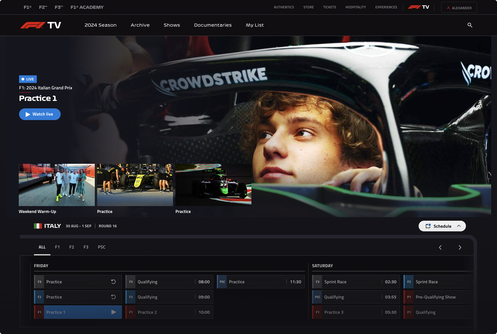

# Boosts

*Boost process works as of **v1.39.0**. [Arc](https://arc.net/) could change how the boosts function at any time, they update often...*

<!-- * [Hugging Face Neutral](./boosts/hugging-face-neutral.css) -->
* [Claude Neutral](./boosts/claude-neutral.css) / [Claude Neutral Darker](./boosts/claude-neutral-darker.css)
* [Keymap Editor (nickcoutsos) Github Dark](./boosts/keymap-editor-github-dark.css)
* [F1TV Dark Fixes](./boosts/f1tv-dark-fixes.css)

# Adding boosts

1. Open [Arc](https://arc.net/)
2. Go to corresponding site for the boost you're installing (e.g. [claude.ai](https://claude.ai/))
3. Click the `Site Control Center` button to the right of the URL bar
4. Click `New Boost` button (the paint brush icon)
5. Click `Code` button towards the bottom
6. Copy the CSS from the corresponding boost (e.g. [claude-neutral.css](./boosts/claude-neutral.css))
7. Paste the copied text into the `CSS` editor

**DONE!**

<!-- ## Hugging Face Neutral (WIP) -->
<!---->
<!-- Another Neutral modification, this time changing the [Hugging Face](https://huggingface.co/) ~~blue~~ dark theme to my favorite neutral greys an whites. All icons and accent colors are left unchanged. -->
<!---->
<!-- [hugging-face-neutral.css](./boosts/hugging-face-neutral.css) -->
<!---->
<!--  -->

## Claude Neutral

Claude Neutral removes the green-ish/yellow-ish tint from the original claude.ai UI. Neutral greys only.

[claude-neutral.css](./boosts/claude-neutral.css) · [claude-neutral-darker.css](./boosts/claude-neutral-darker.css)

## Keymap Editor (nickcoutsos) Github Dark

Matches [Keymap Editor](https://github.com/nickcoutsos/keymap-editor) background to the Github Dark theme to improve the look of screenshots in repos.

[keymap-editor-github-dark.css](./boosts/keymap-editor-github-dark.css)

## F1 TV Dark Fixes

Changes the white global header to a dark grey and creates an even dark background for the site.

[f1-tv-dark-fixes.css](./boosts/f1-tv-dark-fixes.css)

## License

[MIT license](./LICENSE)
